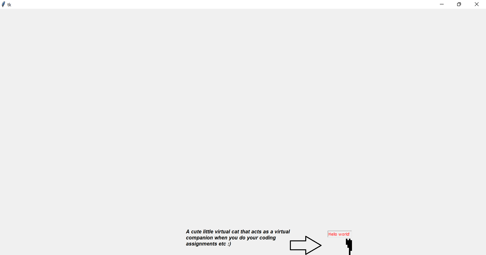

# PyCat.exe 🐱 (The cat that hopes to prevent eye-strain for programmers)

Pycat.exe is a desktop executable application that generates a cute little virtual cat on the bottom of your screen.

It has two main purposes actually, i.e. to act as:

- a) as a virtual companion, and more importantly
- b) as a tool to help prevent eye-strain & various eye-related conditions for programmers (& the general public)

## How to set up the project locally?

1. Clone the repository using `git clone https://github.com/melvincwng/pycat.exe.git` command.
2. In the root directory, go into the `src` folder. You should see pycatDemo.zip & pycatFinal.zip.
3. Copy the pycatFinal.zip into another new folder of your choice & unzip it.
4. Open the folder & you should see a `pycat.exe` file. Click on it to run the application.
5. For the live demo, we will be using pycatDemo.zip instead (contains slightly modified code meant specifically for demo purposes). Copy the pycatDemo.zip into another new folder of your choice, unzip it & then run the `pycat.exe` file as well.
6. Alternatively, clone the repository, open it using your IDE of choice & `cd src` to get into the src/ folder. Then, run the command `python pycat.py` to run the application.

## Problem statement / Problem description (What is the problem you are trying to solve in the hackathon?)

Millions of people around the world suffer from dry eye & other eye related conditions due to prolonged exposure to digital screens. This is true for programmers as well since they spent a huge amount of their careers staring at a computer screen. This is a huge problem since it can lead to various eye-related conditions such as [1-2]:

- Eyestrain
- Blurred vision
- Dry eyes
- and many more...

This is a huge problem since sufferers of such vision-related conditions usually experience a decrease in productivity, thus causing businesses & economies to sustain huge losses every year [3-4].

While there are indeed pharmacological approaches to combat these eye-related issues caused by prolonged digital screen exposure, however, I strongly believe that there are also non-pharmacological approaches that can be created and utilized to help prevent such eye-related conditions from happening in the first place.

## Why did I choose this problem?

During the hackathon, I observed many of the participants (including myself) spending huge amounts of time staring at our screens and coding. Also, I've observed that not many people were taking breaks regularly as well.

While I understand that the prizes for the Hackathon are attractive, nonetheless, I still believe it is more important to take care of our health & well-being. This is why I decided to create a tool that can help programmers (and the general public) to take regular breaks & hopefully prevent eye-strain.

## How it works?

Quite simply, you click on the `pycat.exe` file. Initially, it generates a cute little virtual cat on the bottom of your screen. It will then move around the bottom of your screen & do its own thing (enjoy the cute little animations).

Every 20 minutes, you will start to notice your cat no longer being energetic & in fact, it will become deceased. This is an indicator for you to take a break from your screen. This subtle act of the cat "dying" is to remind you to take a break & to look away from the screen for a while, for we only have one pair of eyes, and ultimately one life only 👀.

This approach/solution used in this desktop app is actually inspired from actual recommendations/guidance by the [American Academy of Ophthalmology](https://www.aao.org/eye-health/tips-prevention/digital-devices-your-eyes). They recommend that you take a break every 20 minutes & look away from the screen for 20 seconds at things that are at least 20 feet away [5].

## Languages/Libraries/Tools used

- Python (Core programming language)
- Tkinter (Python GUI library)
- Ezgif.com (gif maker)
- Open source art assets by [Bow.Pixel](https://bowpixel.itch.io/cat-anim-16x16-black)
- Pyinstaller (to package everything up & create the executable/.exe file)

## Live Demo:

- Will be conducted during Judging session on 15/01/2023
- Some screenshots:
  - 
  - 
  -  (Logo)
- Devpost link: https://devpost.com/software/pycat-exe

## Future plans (if there's time to work on this beyond the scope of the hackathon):

- KIV at the moment:
  - More pets of different colour schemes,
  - Make into chrome extension (since PyInstaller compiled exe files by Windows don't work in macOS) &
  - Possibility of integrating various AI/ML libraries - e.g. to track eyes movement via your webcam? (e.g. ScikitLearn? If it's feasible & got such pre-trained models to use?)

## Post Hackathon Reflection:

- My thoughts on the entire NUS Hack & Roll Hackathon 2023 can be found [here](https://musubi.vercel.app/admin1/nus-hack-and-roll-2023)
- Overall, very fun & enjoyable event, and got to meet & network with some amazing people ✨

## Hackathon Counter & Tracker 🧮:

1. DBS Techtrek 2021 (Virtual Hackathon)
2. GitHub Hacktoberfest 2022 (Virtual Hackathon)
3. NUS Hack & Roll 2023 (Physical Hackathon)

## Done by:

- Melvin Ng (Tag Number: T430, Participant ID: #609, Participant Table: 160)
- Created as part of the NUS Hack&Roll 2023 Hackathon event (14/01/2023 - 15/01/2023)

## References:

1. [American Optometric Association - Computer Vision Syndrome](https://www.aoa.org/healthy-eyes/eye-and-vision-conditions/computer-vision-syndrome?sso=y)
2. [American Optometric Association - Eye & Vision Conditions](https://www.aoa.org/healthy-eyes/eye-and-vision-conditions/dry-eye?sso=y)
3. [Impact of dry eye on work productivity - by Masakazu Yamada, Yoshinobu Mizuno, and Chika Shigeyasu](https://www.ncbi.nlm.nih.gov/pmc/articles/PMC3471464/)
4. [Making Eye Health a Population Health Imperative: Vision for Tomorrow.](https://www.ncbi.nlm.nih.gov/books/NBK402367/)
5. [American Academy of Ophthalmology - Computer Vision Syndrome](https://www.aao.org/eye-health/tips-prevention/computer-vision-syndrome)
6. [Tkinter Documentation](https://docs.python.org/3/library/tkinter.html)
7. [StackOverFlow](https://stackoverflow.com/)
8. [Seebass22's Technical Blog](https://seebass22.github.io/python-desktop-pet-tutorial/)
